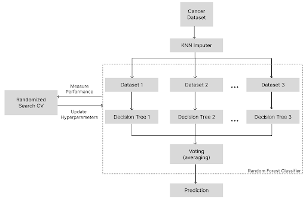
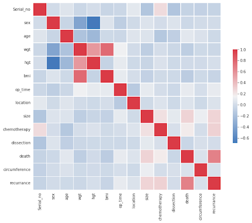
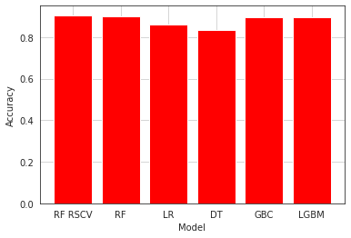
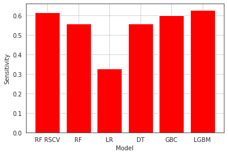
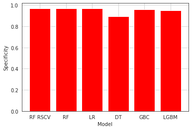
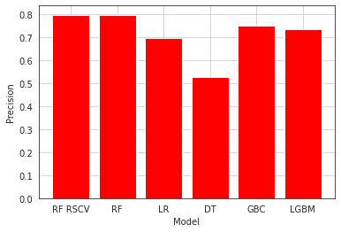
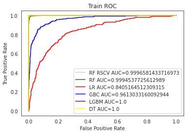
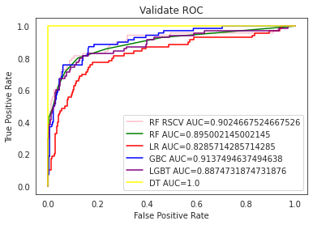

# Recurrent Gastric Cancer Prediction using Randomized Search CV Optimizer

## Authors

- Vishnu M K
- Vedhapriyaa S
- Vishal Rupak V R

## Copyright Information

⚠️ Copyright Notice: This research project, including the report, is copyrighted. All rights are reserved by the authors.

For detailed copyright information and access to the report, please refer to the [Copyright File](/Copyright.pdf) located in this repository.

## Abstract

Gastric cancer is a leading cause of mortality and incidence of malignant tumors worldwide. Early detection of stomach cancer is crucial for better prognosis, but the symptoms are often subtle and not immediately apparent. This research project aims to improve the accuracy of a prediction model for the emergence of gastric cancer using patient clinicopathological data and machine learning techniques. We propose the use of Gradient Boosted Decision Tree, Random Forest, Decision Tree, and Gradient Boosting Machine, Logistic Regression algorithms to predict the recurrence of malignant tumors in patients after surgery. Furthermore, we enhance the Random Forest algorithm using the Random Search Cross Validation optimizer to improve the model's performance in predicting cancer. The dataset used in this project contains 2012 patient records along with 51 characteristics.

## Project Images

This repository includes the following images related to the research project:

1. **Architecture Diagram**:
   An image illustrating the architecture of the proposed model.  
   

2. **Correlation Analysis**:
   An image showing the correlation analysis results of the dataset.  
   

## Evaluation Metrics

This repository includes the following images for the evaluation metrics:

1. **Accuracy**:
   An image presenting the accuracy metric.  
   

2. **Sensitivity**:
   An image presenting the sensitivity metric.  
   

3. **Specificity**:
   An image presenting the specificity metric.  
   

4. **Precision**:
   An image presenting the precision metric.  
   

5. **AUC ROC Curve**:
   An image depicting the Area Under the Receiver Operating Characteristic (ROC) Curve.  
   
   

## Conclusion

Our findings demonstrate that machine learning techniques can effectively predict the recurrence of gastric cancer in patients after surgery. The factors identified as significant in determining the reappearance of stomach cancer following surgery are BMI, operation duration, weight, and age. The best-performing algorithms for predicting recurrent gastric cancer were found to be GNB, XGBoost, and Random Forest. To further enhance the accuracy of the machine learning models, optimization approaches can be implemented. Future research should focus on larger datasets and more comprehensive machine learning studies to identify the most accurate algorithm and enable personalized therapies.

## Dataset

The data used in this research project is sourced from the BioStudies database, with accession numbers: S-EPMC4344235. The dataset includes 2012 patient records from retrospective studies. The data encompasses various attributes such as age, gender, pathological characteristics, treatment-related factors, and follow-up period related to survival status.

## Base Paper

Title: A machine learning-based predictor for the identification of the recurrence of patients with gastric cancer after operation  
Authors: Chengmao Zhou, Junhong Hu, Ying Wang, Mu-Huo Ji, Jianhua Tong, Jian-Jun Yang, Hongping Xia  
Access the full paper [here](https://www.nature.com/articles/s41598-021-81188-6).

For any inquiries or further information, please contact the corresponding author Vishnu M K at mkv1722@gmail.com.
